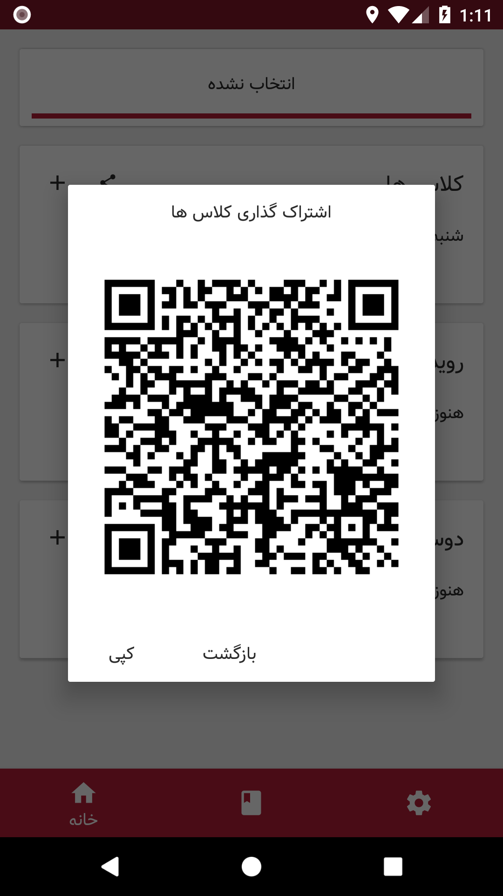
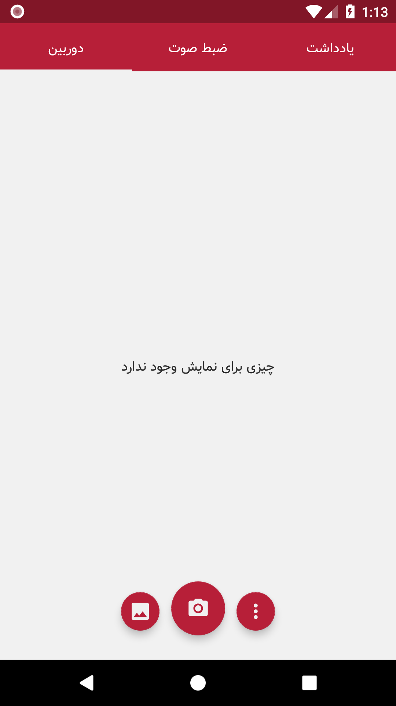
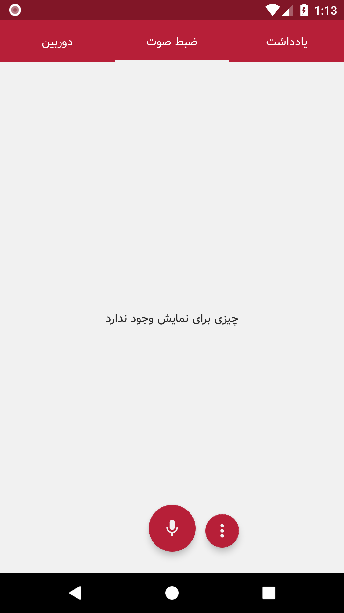
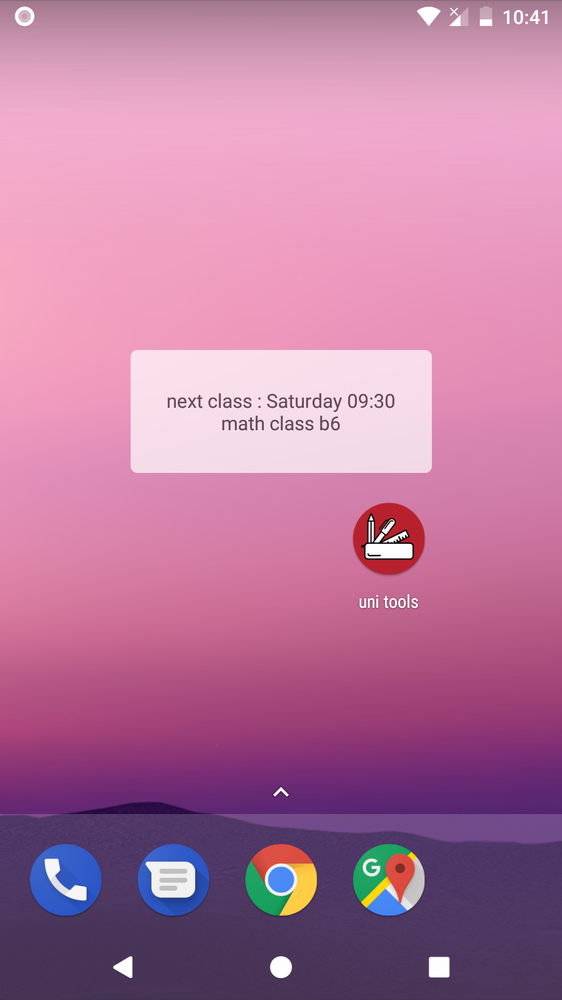

# UniTools
free (as freedom) software for daily student stuffs
 
# screen shots

 
 

 

  
 
 

# features
manage classes
 
manage events
 
auto silent mobile when your class starts
 
share classes list with frinds with QR code and link (works offline)
 
widget for see next class
 
alarm when you are close to next class
 
manage pdf ,pics ,voices ,notes
 
generate pdf from photos
 
share pdfs and pics and voices
 
absent counter
 
support "english" and "فارسی" language

# People who helps 
[Sabih farhangi](https://github.com/sabih1998)  
[mohammad bagherlo](https://github.com/bgl-mmd)  
[ustMeErazem](https://github.com/JustMeErazem)  
[hooman mir shafiee](https://github.com/Hoomanmsh)

# contribution
[how to add new language to app](https://github.com/unitools-apps/UniTools-android/wiki/How-to-add-new-Language-to-this-app)  
[report bugs and offer new feature](https://github.com/unitools-apps/UniTools-android/issues)
